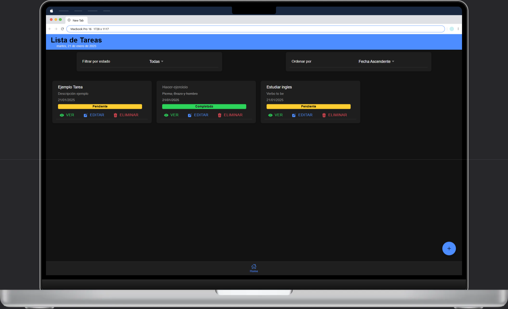
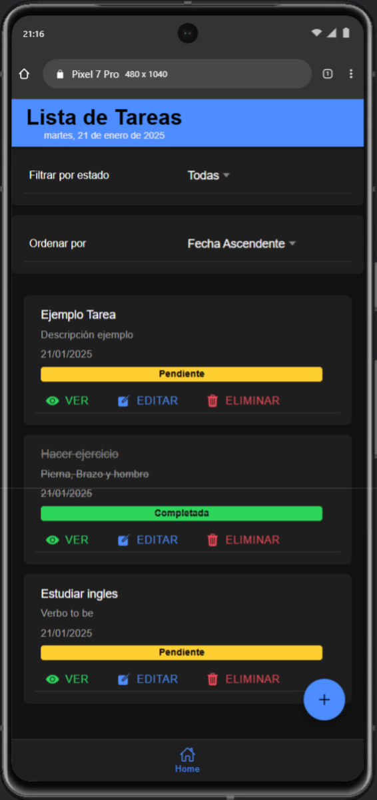

# Tasks App  - Prueba Técnica
<div align="center">
  
  
</div>


## Descripción
Aplicación de gestión de tareas desarrollada con Ionic y Angular que permite crear, editar y gestionar tareas diarias. La aplicación es completamente responsiva y funciona en dispositivos móviles y desktop.

## Características

- Interfaz oscura moderna y minimalista
- Gestión completa de tareas (CRUD)
- Filtrado por estado de tareas
- Ordenamiento por fecha
- Indicadores de estado (Pendiente/Completada)
- Diseño responsive para múltiples dispositivos
-Interfaz intuitiva con botones de acción (Ver, Editar, Eliminar)

## Requisitos Previos

- Node.js (v14 o superior)
- npm (v6 o superior)
- Ionic CLI
- Angular CLI
- Capacitor (para compilación móvil)

## Instalación

1. Istalla Ionic CLI
```bash
npm install -g @ionic/cli
```

2. Clonar el repositorio
```bash
git clone https://github.com/ImanolPG2/tasks-app-babel

cd tasks-app-babel
```

3. Instalar dependencias
```bash
npm install
```

## Ejecución android
Necesitas tener android studio en tu pc configurado

### Android studio
```bash
npm install -g @ionic/cli native-run cordova-res
```
```bash
ionic capacitor add android
```
```bash
npx cap open android
```

## Ejecución IOS

### Xcode
Necesitas tener Xcode en tu pc configurado
```bash
npm install -g @ionic/cli native-run cordova-res
```
```bash
ionic capacitor add ois
```
```bash
npx cap run ios
```


## Ejecución web

### Desarrollo local
```bash
npm run start
# or
ionic serve
```

## Estructura del Proyecto
```
proyecto/
├── .angular/                   # Configuración de Angular
├── .vscode/                    # Configuración del editor VSCode
├── node_modules/              # Dependencias del proyecto
├── src/                       # Código fuente principal
│   ├── app/                   # Componentes y lógica principal
│   │   ├── detail-tack/       # Módulo de detalle de tarea
│   │   │   ├── detail-tack-routing.module.ts
│   │   │   ├── detail-tack.module.ts
│   │   │   ├── detail-tack.page.css
│   │   │   ├── detail-tack.page.html
│   │   │   ├── detail-tack.page.spec.ts
│   │   │   └── detail-tack.page.ts
│   │   │
│   │   ├── edit-task/        # Módulo de edición de tarea
│   │   │   ├── edit-task-routing.module.ts
│   │   │   ├── edit-task.module.ts
│   │   │   ├── edit-task.page.css
│   │   │   ├── edit-task.page.html
│   │   │   ├── edit-task.page.spec.ts
│   │   │   └── edit-task.page.ts
│   │   │
│   │   ├── home/             # Módulo de página principal
│   │   │   ├── home-routing.module.ts
│   │   │   ├── home.module.ts
│   │   │   ├── home.page.css
│   │   │   ├── home.page.html
│   │   │   ├── home.page.spec.ts
│   │   │   └── home.page.ts
│   │   │
│   │   ├── interface/        # Interfaces TypeScript
│   │   ├── services/         # Servicios de la aplicación
│   │   ├── tabs/            # Componente de pestañas
│   │   │
│   │   ├── app-routing.module.ts
│   │   ├── app.component.html
│   │   ├── app.component.scss
│   │   ├── app.component.spec.ts
│   │   ├── app.component.ts
│   │   └── app.module.ts
│   │
│   ├── assets/              # Recursos estáticos
│   ├── environments/        # Configuración de entornos
│   ├── theme/              # Estilos globales
│   ├── global.scss         # Estilos globales
│   └── index.html          # Punto de entrada HTML
```

## Autores
